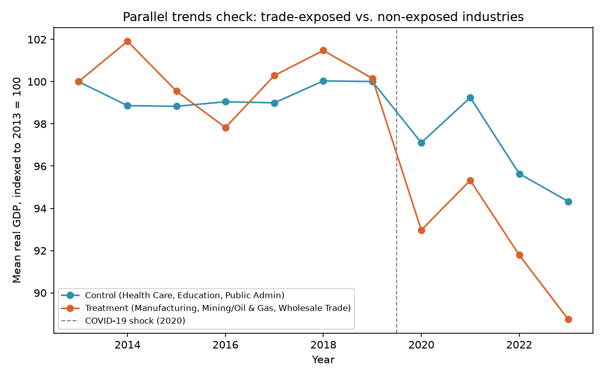

# Trade Shocks and Industry Performance in Canada (2013–2023)

An end-to-end analysis of how international trade shocks and CAD-USD exchange rate fluctuations affected the financial performance of Canadian firms between 2013 and 2023, combining firm-level financial data with industry-level trade exposure, GDP, and exchange rate data.

## Problem

Canadian firms lived through major trade disruption between 2013 and 2023 — a large CAD depreciation (2014–2016), COVID-19, and a volatile post-pandemic trade rebound. The project asks five questions, one per team member, each owning their question end-to-end (data prep → modeling → interpretation) while contributing to one unified analysis:

1. Which industries in Canada are growing, and is there regional variation in performance?
2. Which industries and regions are most exposed to trade shocks?
3. How do international trade shocks impact firm performance across industries?
4. How do CAD-USD exchange rate fluctuations influence profitability in export-heavy vs. import-heavy industries?
5. Do small and large firms respond differently to trade shocks within the same industry?

**Hypotheses going in:** industries with greater trade exposure would see larger profitability swings during shocks. CAD depreciation would benefit export-heavy industries and compress margins in import-heavy ones. Small firms would be more shock-sensitive than large firms due to thinner financial buffers and regional differences would largely reflect industry mix (resource provinces more resilient than manufacturing-heavy ones).

## Data

- **Sources:** Government of Canada / Statistics Canada open data — no web scraping or proprietary data.
  - Firm-level financial performance (revenue, expenses, industry ratios), 2013–2023, split into separate annual CSVs.
  - Industry- and province-level trade exposure (import/export measures).
  - CAD-USD exchange rate series (Statistics Canada).
  - National trade/GDP aggregates for macroeconomic context.
- **Scale:** revenue and expense files exceeded 100,000 records combined.
- **Segmentation:** firms split into revenue cohorts (e.g. \$20K–\$5M "small" vs. \$5M–\$20M+ "large") to test size-based differences in shock response.

**Data challenges:** revenue data had province- and industry-level detail while expense data was national-only. Trade exposure datasets didn't cover every industry present in the financial data, financial data was fragmented into separate yearly files requiring careful schema alignment and NAICS industry-code reconciliation across years. One file had incomplete year coverage, discovered and resolved through team troubleshooting.

## Methodology

- Standardized column names/types across years, merged annual financial files into a unified panel dataset, reconciled NAICS industry codes for comparability, and aligned province-level with national-level data where possible.
- **Q1 — Industry growth:** computed Real GDP (Nominal GDP × 100 / CPI) and CAGR by industry and province to identify growth trends and regional variation.
- **Q2 — Trade exposure:** measured total trade and net exports as a % of GDP by industry, and mapped regional trade exposure by province.
- **Q3 — Shock impact on performance:** ran regression models (`log_rev ~ trade_shock + net_trade_exposure + C(trade_sector) + C(year)` and the equivalent for revenue growth) and split the sample into normal/positive-shock/negative-shock regimes (using COVID-19 and the post-COVID rebound as the defining shock events) to compare sector-level revenue-growth outcomes.
- **Q4 — Exchange rate effects:** built a correlation matrix across revenue growth, expense growth, FX change, export growth, and import growth, and visualized FX-vs-revenue-growth and FX-vs-expense-growth relationships.
- **Q5 — Firm size:** estimated a panel regression with a shock × small-firm interaction term (`PanelOLS`, entity and time fixed effects, clustered standard errors) to test whether trade shocks affect small and large firms differently.
- **Tools:** Python (pandas for cleaning/merging/reshaping), Jupyter/Colab, `statsmodels`/`linearmodels` (PanelOLS, fixed-effects regression), seaborn/matplotlib for visualization.

### Q6 — Difference-in-differences: causal impact of trade shock exposure

Q3 above used *continuous* trade-shock magnitude as a predictor and found it wasn't statistically
significant once industry and year effects were controlled for. Q6 asks a related but different
question with a proper causal design: did industries *structurally exposed* to trade (regardless
of a given year's shock size) fare worse specifically around the COVID-19 shock than industries
that aren't trade-exposed at all? Full analysis, code, and diagnostics:
[`EDA/Q6-Difference-in-Differences Trade Shock Impact.ipynb`](<EDA/Q6-Difference-in-Differences Trade Shock Impact.ipynb>).

**Data note:** the firm-level revenue and expense files and the raw export/import trade tables
were originally committed to this repo as empty 2-byte placeholders — the team's real copies lived
in a shared Google Drive folder. They have since been restored from it (public Statistics Canada
data), so `Data/` now holds:
- `export.csv` — 35,632 rows (value of exports and number of exporting establishments, by industry and geography)
- `import.csv` — 30,470 rows (value of imports and number of importing establishments)
- `Revenue.csv.zip` — 793,898 rows, 2013–2023
- `Expenses.csv.zip` — 364,043 rows, 2013–2023

Revenue and Expenses are stored zipped because the uncompressed Expenses file (103 MB) is over
GitHub's 100 MB per-file limit; pandas reads them directly, e.g. `pd.read_csv("Data/Revenue.csv.zip")`.
(The data-prep notebooks in `EDA/` refer to a `../RawData/` folder; in this repo those files are in `Data/`.)

Q6 itself was built while those files were still missing, so it uses **real GDP by industry**
(from `gdp.csv`, 2013–2023) as the outcome variable instead of firm revenue — a genuine
substitution stated explicitly, not glossed over. Re-running it on firm revenue is now possible
(see Possible extensions).

**Treatment / control:**
- **Treatment (trade-exposed):** Mining/Oil & Gas Extraction, Manufacturing, Wholesale Trade — the
  three industries Q2 above identified as having the largest net trade exposure.
- **Control (non-tradable):** Health Care & Social Assistance, Educational Services, Public
  Administration — domestically-anchored, largely publicly-funded sectors with minimal direct
  trade exposure.
- **Post period:** `year >= 2020` (the COVID-19 trade shock — the same event Q3 already treated as
  the defining shock for 2013–2023).
- Panel: 13 provinces × 6 industries × 11 years = 858 balanced observations.

**Parallel trends check (required before trusting the estimate):**



Visually the two groups move together in a fairly narrow band from 2013–2019, then diverge sharply
after 2020. Formally, a pre-period-only regression (`log_real_gdp ~ treatment*year_trend`,
2013–2019) found a small but statistically significant differential pre-trend:
**treatment industries were already drifting down ~0.8%/year relative to control industries before
the shock (coefficient -0.0083, p = 0.024)** — about a tenth the size of the post-shock effect
below. Parallel trends holds *approximately*, not exactly, and that caveat is carried into the
interpretation rather than dropped.

**Causal estimate:** `log(real_gdp) ~ treatment + post + treatment:post`, clustered standard
errors by industry:

| Term | Coefficient | p-value | 95% CI |
|---|---|---|---|
| `treatment:post` | **-0.0782** | 0.005 | [-0.132, -0.024] |

Industries exposed to the COVID-19 trade shock saw real GDP decline an additional **~7.5%**
relative to non-exposed industries, holding pre-existing level differences and the shared
post-2020 trend constant. The estimate is unchanged (-0.078, p = 0.005) under a province + year
fixed-effects specification, so it isn't an artifact of the simple `post` dummy.

**Interpretation, with the caveat carried through:** given the small but real pre-existing
divergence between the groups, the true effect of the shock itself is most plausibly somewhat
smaller than -7.5% once that drift is netted out — but the direction (trade-exposed industries hit
harder) and rough magnitude hold up under the fixed-effects robustness check. This is presented as
a genuine causal estimate with a stated, non-trivial limitation, not a clean natural experiment.

## Results

**Industry growth (Q1):** Finance, Professional Services, Health, and Public Administration showed steady positive growth across all provinces. NAICS 55 (Management of Companies) declined sharply everywhere (~-20% CAGR) — a structural decline, not a regional one. Resource-rich provinces (Alberta, Saskatchewan, Newfoundland & Labrador) grew in mining/oil & gas and transportation and large provinces (Ontario, Quebec, BC) showed broad service-led growth.

**Trade exposure (Q2):** Trade exposure is highly concentrated — Wholesale Trade showed the largest net-import exposure, Mining/Oil & Gas the largest net-export exposure. Ontario and New Brunswick had the highest trade exposure as a share of GDP (manufacturing and Irving oil/port activity, respectively). Trade exposure has expanded markedly since 2020.

**Shock impact on firm performance (Q3):** Trade shock and net trade exposure were **not statistically significant** predictors of firm revenue or revenue growth once controlling for industry and year effects (p = 0.372 and p = 0.688 respectively). Year effects for 2020/2021 (COVID and the rebound) *were* statistically significant. Revenue growth was actually more stable during extreme trade-shock periods (mean growth 0.72% during negative shocks, 1.48% during positive shocks) than the hypotheses predicted — Health Care and Social Assistance was hit hardest during negative shocks. Agriculture showed the strongest positive growth.

**Exchange rate effects (Q4):** Revenue showed a slight positive correlation with FX change (r = 0.16) — consistent with export-heavy firms benefiting from CAD depreciation — while expenses were nearly uncorrelated with FX movement (r = 0.08), suggesting many costs are domestic/fixed rather than import-linked. Overall correlations across the dataset were weak, pointing to sector-specific rather than economy-wide FX dynamics.

**Firm size (Q5):** Small firms showed substantially and consistently higher log revenue growth than large firms across the trade-shock and import-shock range (coefficient ≈ 4.5, p < 0.001 in both specifications), with tighter, more consistent outcomes. Large firms showed much wider dispersion, including more instances of negative growth under bigger shocks. A small firm × shock interaction term was negative and marginally significant, suggesting the small-firm growth advantage erodes somewhat as shock magnitude increases.

## Key takeaways

- **Causal estimate (Q6):** industries structurally exposed to trade (Manufacturing, Mining/Oil & Gas, Wholesale Trade) saw real GDP decline an additional ~7.5% relative to non-trade-exposed industries during the COVID-19 shock, holding pre-existing differences and the shared time trend constant (diff-in-diff, p = 0.005) — robust to a fixed-effects specification, though a small pre-existing differential trend means this should be read as directionally right rather than a perfectly clean estimate.
- Trade shocks did **not** have a statistically significant average effect on Canadian industry revenue between 2013–2023 once macro effects (COVID, the rebound) were controlled for — economy-wide shocks dominated over trade-specific ones. (Note this asks a different question than Q6 above: Q3 tests year-to-year trade-shock *magnitude*, Q6 tests being a structurally trade-exposed industry *at all* during COVID specifically — the two aren't contradictory.)
- Trade exposure is concentrated in a small number of industries (wholesale, mining/oil & gas, manufacturing), so disruption effects were reallocated across those sectors rather than spread economy-wide.
- Small firms grew faster than large firms on average and were more resilient to trade shocks specifically — but that resilience isn't unconditional, it appears to erode somewhat as shock size increases.
- Exchange-rate effects were directionally consistent with trade theory (depreciation helps exporters more than it costs importers) but modest in magnitude.
- Real-world open data has real limitations: incomplete incorporation-status coding, granularity mismatches between revenue and expense files, and partial trade-exposure industry coverage all constrained the analysis — findings are framed as learning-purpose, not policy-ready, for this reason.

## Repo structure
```
├── Data/                       # input CSVs; Revenue and Expenses are zipped (see the Q6 data note above)
├── EDA/
│   ├── Q1 ... Q5-*.ipynb        # original five questions
│   ├── Q6-Difference-in-Differences Trade Shock Impact.ipynb
│   ├── parallel_trends_check.png
│   └── Create_*.ipynb           # data-prep notebooks for trade/exchange-rate/revenue CSVs
├── Final_Project_Notebook.ipynb
├── Trade Shocks and Industry Performance in Canada (2013–2023).pdf
└── README.md
```

## Possible extensions
- Add a lagged-FX specification, since exchange-rate effects on revenue may show up with a delay rather than contemporaneously.
- Run placebo/robustness checks with alternative trade-exposure metrics, as originally planned in the approach but not fully executed given data-availability constraints.
- Extend the firm-size interaction analysis with confidence intervals visualized directly against the shock-magnitude axis, to make the "resilience erodes at larger shocks" finding more visually explicit.
- Now that the firm-level revenue and export/import files are restored (see the Q6 data note), re-run the diff-in-diff on firm revenue directly and with a continuously-measured trade-exposure treatment, rather than GDP and an a priori industry classification.
- Use a matched-trends or synthetic-control approach for the control group to close the small pre-trend gap Q6 found, rather than the a priori sector classification used here.
