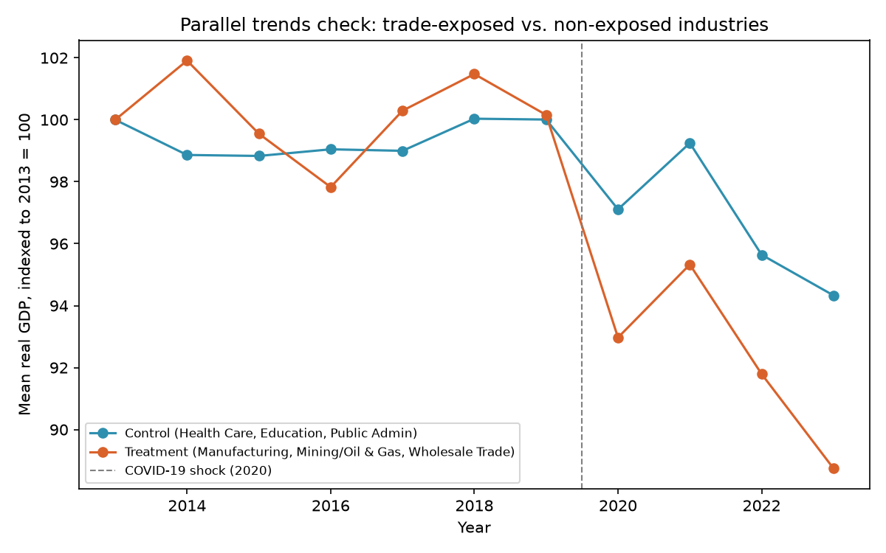

# Trade Shocks and Industry Performance in Canada (2013–2023)

**Team (Group 12, Foundations of Data Science course, University of Waterloo WATSPEED Data Science Certificate):** Dimpal Rana, Iqbal Bamrah, Maxime Joseph, Mrittika, Sadok Jbenyeni

## Problem

Canadian firms lived through major trade disruption between 2013 and 2023: a large CAD depreciation (2014–2016), COVID-19, and a volatile post-pandemic trade rebound. The project asks how international trade shocks and CAD-USD exchange rate fluctuations affected Canadian industry and firm performance, through five questions (one per team member, each owned end-to-end from data prep to interpretation) plus a sixth causal follow-up:

1. Which industries in Canada are growing, and is there regional variation in performance?
2. Which industries and regions are most exposed to trade shocks?
3. How do international trade shocks impact firm performance across industries?
4. How do CAD-USD exchange rate fluctuations influence profitability in export-heavy vs. import-heavy industries?
5. Do small and large firms respond differently to trade shocks within the same industry?
6. Did industries *structurally exposed* to trade fare worse around the COVID-19 shock than industries that aren't trade-exposed at all? (difference-in-differences)

**Hypotheses going in:**
- Industries with greater trade exposure would see larger profitability swings during shocks.
- CAD depreciation would benefit export-heavy industries and compress margins in import-heavy ones.
- Small firms would be more shock-sensitive than large firms, due to thinner financial buffers.
- Regional differences would largely reflect industry mix.

## Data

- **Sources:** Government of Canada / Statistics Canada open data (no web scraping or proprietary data):
  - Firm-level financial performance (revenue, expenses, industry ratios), 2013–2023, originally split into annual files: `Revenue.csv.zip` (793,898 rows) and `Expenses.csv.zip` (364,043 rows), zipped to stay under GitHub's 100 MB file limit.
  - Trade by industry and geography: `export.csv` (35,632 rows) and `import.csv` (30,470 rows), with values and numbers of exporting/importing establishments.
  - CAD-USD exchange rate series, GDP by industry (`gdp.csv`), CPI (`cpi.csv`), and a NAICS industry-code master table.
- **Segmentation:** firms split into revenue cohorts (e.g. \$20K–\$5M "small" vs. \$5M–\$20M+ "large") to test size-based differences in shock response.
- **Data challenges:** revenue data had province- and industry-level detail while expense data was national-only. Trade-exposure data didn't cover every industry in the financial data, and the yearly financial files needed schema alignment and NAICS code reconciliation across years.

## Methodology

- **Data preparation:** standardized column names and types across years, merged the annual financial files into one panel dataset, reconciled NAICS industry codes, and aligned province-level with national-level data where possible.
- **Q1 (industry growth):** computed real GDP (nominal GDP × 100 / CPI) and CAGR by industry and province.
- **Q2 (trade exposure):** measured total trade and net exports as a % of GDP by industry, and mapped trade exposure by province.
- **Q3 (shock impact):** regression models (`log_rev ~ trade_shock + net_trade_exposure + C(trade_sector) + C(year)`, and the equivalent for revenue growth), plus a comparison of sector revenue growth across normal / positive-shock / negative-shock regimes (COVID-19 and the rebound as the defining shock events).
- **Q4 (exchange rates):** correlation matrix across revenue growth, expense growth, FX change, export growth, and import growth, with FX-vs-revenue and FX-vs-expense visualizations.
- **Q5 (firm size):** panel regression with a shock × small-firm interaction term (`PanelOLS`, entity and time fixed effects, clustered standard errors).
- **Q6 (difference-in-differences):** `log(real_gdp) ~ treatment + post + treatment:post` with standard errors clustered by industry, on a balanced panel of 13 provinces × 6 industries × 11 years (858 observations).
  - *Treatment:* the three most trade-exposed industries from Q2 (Mining/Oil & Gas, Manufacturing, Wholesale Trade). *Control:* domestically anchored, largely publicly funded sectors (Health Care, Education, Public Administration). *Post period:* 2020 onward.
  - Outcome is real GDP by industry, because the firm-level revenue files were missing from the repo when Q6 was built (they've since been restored).
  - Parallel trends tested with a pre-period-only regression (2013–2019), and robustness checked with a province + year fixed-effects specification.
- **Tools:** Python (pandas), Jupyter/Colab, `statsmodels` / `linearmodels` (PanelOLS, fixed-effects regression), seaborn/matplotlib.

## Results

**Industry growth (Q1):** Finance, Professional Services, Health, and Public Administration grew steadily across all provinces. NAICS 55 (Management of Companies) declined sharply everywhere (~-20% CAGR), a structural rather than regional decline. Resource-rich provinces (Alberta, Saskatchewan, Newfoundland & Labrador) grew in mining/oil & gas and transportation, while large provinces (Ontario, Quebec, BC) showed broad service-led growth.

**Trade exposure (Q2):** exposure is highly concentrated. Wholesale Trade had the largest net-import exposure and Mining/Oil & Gas the largest net-export exposure. Ontario and New Brunswick had the highest trade exposure as a share of GDP (manufacturing and Irving oil/port activity, respectively). Trade exposure expanded markedly after 2020.

**Shock impact (Q3):** trade shock and net trade exposure were **not statistically significant** predictors of firm revenue or revenue growth once industry and year effects were controlled for (p = 0.372 and p = 0.688). The 2020/2021 year effects (COVID and the rebound) *were* significant. Revenue growth was more stable during extreme trade-shock periods than hypothesized (mean growth 0.72% during negative shocks, 1.48% during positive shocks). Health Care and Social Assistance was hit hardest during negative shocks, and Agriculture showed the strongest positive growth.

**Exchange rates (Q4):** revenue had a slight positive correlation with FX change (r = 0.16), consistent with exporters benefiting from CAD depreciation, while expenses were nearly uncorrelated (r = 0.08), suggesting many costs are domestic or fixed. Correlations were weak overall, pointing to sector-specific rather than economy-wide FX dynamics.

**Firm size (Q5):** small firms had substantially and consistently higher log revenue growth than large firms across the trade-shock and import-shock range (coefficient ≈ 4.5, p < 0.001 in both specifications), with tighter outcomes. Large firms showed much wider dispersion, including more negative growth under bigger shocks. The small-firm × shock interaction was negative and marginally significant.

**Difference-in-differences (Q6):**



| Term | Coefficient | p-value | 95% CI |
|---|---|---|---|
| `treatment:post` | **-0.0782** | 0.005 | [-0.132, -0.024] |

Trade-exposed industries saw real GDP fall an additional **~7.5%** relative to non-exposed industries after the COVID-19 shock. The estimate is unchanged (-0.078, p = 0.005) under province + year fixed effects. The pre-period check found a small but significant differential pre-trend: treatment industries were already drifting down ~0.8%/year relative to control before the shock (coefficient -0.0083, p = 0.024), about a tenth the size of the post-shock effect.

## Key takeaways

- **Structural trade exposure mattered during COVID.** Industries exposed to trade (Manufacturing, Mining/Oil & Gas, Wholesale Trade) lost an additional ~7.5% of real GDP relative to non-exposed industries. Given the small pre-existing drift, the true effect is most plausibly somewhat smaller, but the direction and rough magnitude hold up under the fixed-effects check.
- **Year-to-year trade-shock size did not have a significant average effect** on industry revenue once macro effects (COVID, the rebound) were controlled for. Economy-wide shocks dominated. This is a different question from Q6 (shock *magnitude* vs. being a structurally trade-exposed industry), so the two findings aren't contradictory.
- **Trade exposure is concentrated** in a few industries (wholesale, mining/oil & gas, manufacturing), so disruption was reallocated across those sectors rather than spread economy-wide.
- **Small firms grew faster and were more resilient to trade shocks**, but that resilience appears to erode as shock size increases.
- **Exchange-rate effects matched trade theory in direction** (depreciation helps exporters more than it costs importers) but were modest in size.
- **Open-data limitations constrained the analysis:** incomplete incorporation-status coding, granularity mismatches between revenue and expense files, and partial trade-exposure coverage. Findings are framed as learning-purpose, not policy-ready.

## How to run

1. Install the dependencies: `pip install -r requirements-q6.txt` (pandas, numpy, matplotlib, statsmodels, jupyter). Q5 also needs `linearmodels` (for `PanelOLS`), and the Q4, Q5 and final notebooks use `seaborn` for charts.
2. Run the question notebooks in `EDA/` or [`Final_Project_Notebook.ipynb`](Final_Project_Notebook.ipynb). The Q1–Q5 and data-prep notebooks were built in Google Colab and refer to a `../RawData/` folder. In this repo those files are in `Data/`, so update the paths if running locally. pandas reads the zipped Revenue and Expenses files directly, e.g. `pd.read_csv("Data/Revenue.csv.zip")`.
3. [`EDA/Q6-Difference-in-Differences Trade Shock Impact.ipynb`](<EDA/Q6-Difference-in-Differences Trade Shock Impact.ipynb>) runs locally as-is.

## Repo structure

```
├── Data/                        # input CSVs (Revenue and Expenses are zipped, and pandas reads them directly)
├── EDA/
│   ├── Create_*.ipynb           # data-prep notebooks for the trade, exchange-rate, and revenue/expense datasets
│   ├── Q1 ... Q5-*.ipynb         # one notebook per research question
│   ├── Q6-Difference-in-Differences Trade Shock Impact.ipynb
│   ├── canada_provinces.geojson  # province boundaries for the exposure maps
│   └── parallel_trends_check.png
├── Final_Project_Notebook.ipynb
├── Trade Shocks and Industry Performance in Canada (2013–2023).pdf
├── requirements-q6.txt
└── README.md
```
